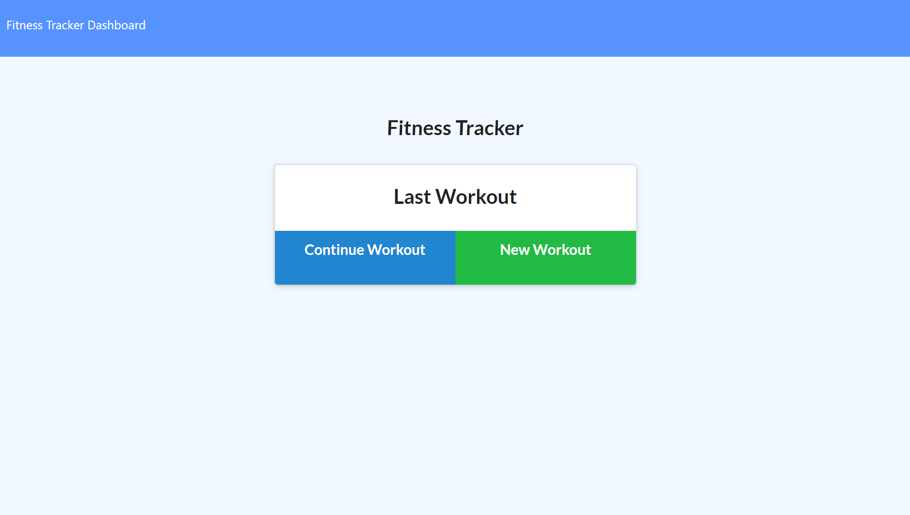

# Fitness Tracker App

2020

### DESCRIPTION

Node based app that starts connects to a Mongo database and allows the user to create exercises, and continue workouts.

[Deployed Link](https://quiet-springs-60038.herokuapp.com/?id=5e5d462779635b4d588ca1b8)

### INSTALLATION INSTRUCTIONS

    - [Local Setup]

1. Setup the database by running the seed.js file located in the seeders folder. You can do this by navigating to the file location, opening it in your terminal and typing "node seed.js."
2. Install the required modules by typing "npm install" or "npm i" in the root folder using your code editor terminal.
3. Run the app by typing "node server.js" or "node server."
4. If successful, the user will see "connected on localhost:3000," and will be able to click on the link to see the app displayed n their default browser.
5. The user can then navigate to localhost:3000 in their browser of choice and utilize the app.

   - [Deployed Setup]

6. [Click on the following Heroku link to see the deployed version.](https://quiet-springs-60038.herokuapp.com/?id=5e5d462779635b4d588ca1b8)

### BUILT WITH

- [HTML](https://html.com/)
- [CSS](https://www.w3schools.com/css/)
- [Javascript](https://www.javascript.com/)
- [JQuery](https://jquery.org/)
- [Bootstrap](https://getbootstrap.com/)
- [Font Awesome](https://fontawesome.com/)
- [Node](https://nodejs.org/en/)
- [NPM](https://www.npmjs.com/)
- [Robo 3T](https://robomongo.org/)
- [Studio 3T](https://studio3t.com/)
- [Heroku](https://www.heroku.com/)
- [Mlab](https://mlab.com//)

### NODE MODULES USED

- [Mongo](https://www.npmjs.com/package/mongo)
- [Express](https://www.npmjs.com/package/express)
- [Morgan](https://www.npmjs.com/package/morgan)

### AUTHOR

- [Github](https://github.com/alpinelife37)
- [Linkedin](https://www.linkedin.com/in/pnw-web-dev)

MIT License

Copyright (c) [2020][james nelson]

Permission is hereby granted, free of charge, to any person obtaining a copy
of this software and associated documentation files (the "Software"), to deal
in the Software without restriction, including without limitation the rights
to use, copy, modify, merge, publish, distribute, sublicense, and/or sell
copies of the Software, and to permit persons to whom the Software is
furnished to do so, subject to the following conditions:

The above copyright notice and this permission notice shall be included in all
copies or substantial portions of the Software.

THE SOFTWARE IS PROVIDED "AS IS", WITHOUT WARRANTY OF ANY KIND, EXPRESS OR
IMPLIED, INCLUDING BUT NOT LIMITED TO THE WARRANTIES OF MERCHANTABILITY,
FITNESS FOR A PARTICULAR PURPOSE AND NONINFRINGEMENT. IN NO EVENT SHALL THE
AUTHORS OR COPYRIGHT HOLDERS BE LIABLE FOR ANY CLAIM, DAMAGES OR OTHER
LIABILITY, WHETHER IN AN ACTION OF CONTRACT, TORT OR OTHERWISE, ARISING FROM,
OUT OF OR IN CONNECTION WITH THE SOFTWARE OR THE USE OR OTHER DEALINGS IN THE
SOFTWARE.
